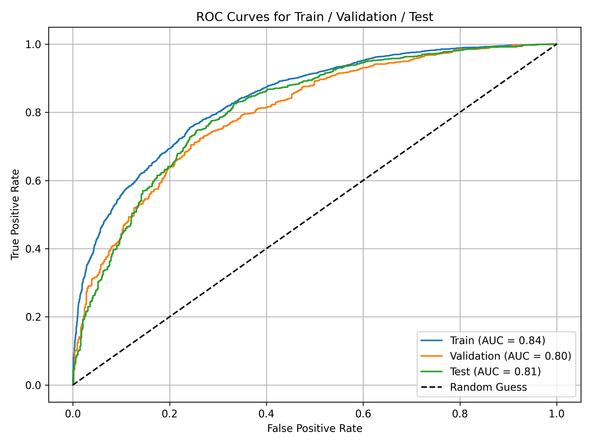
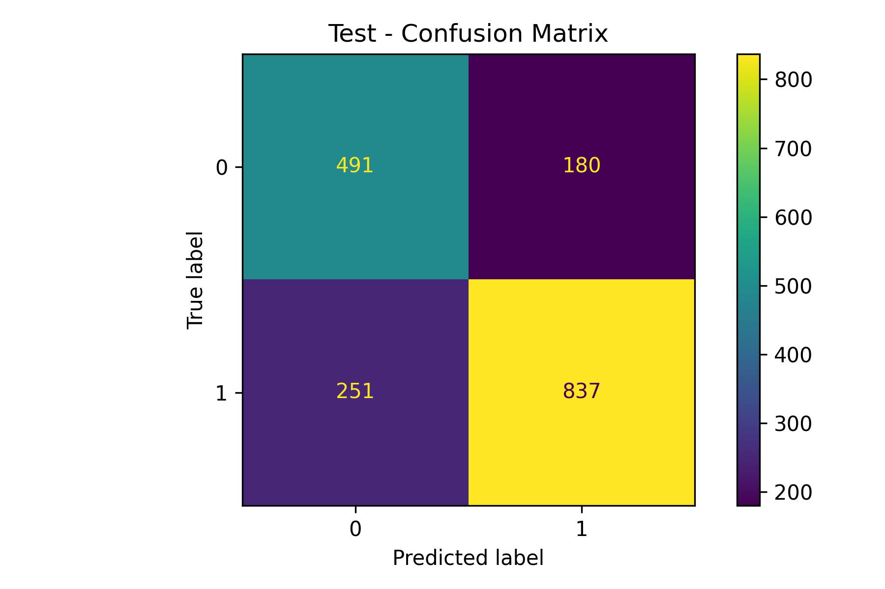
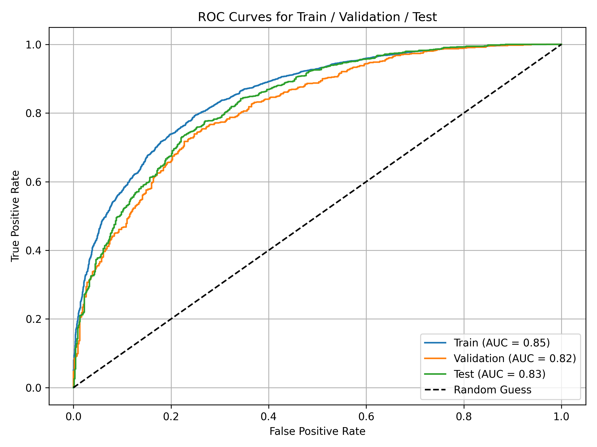
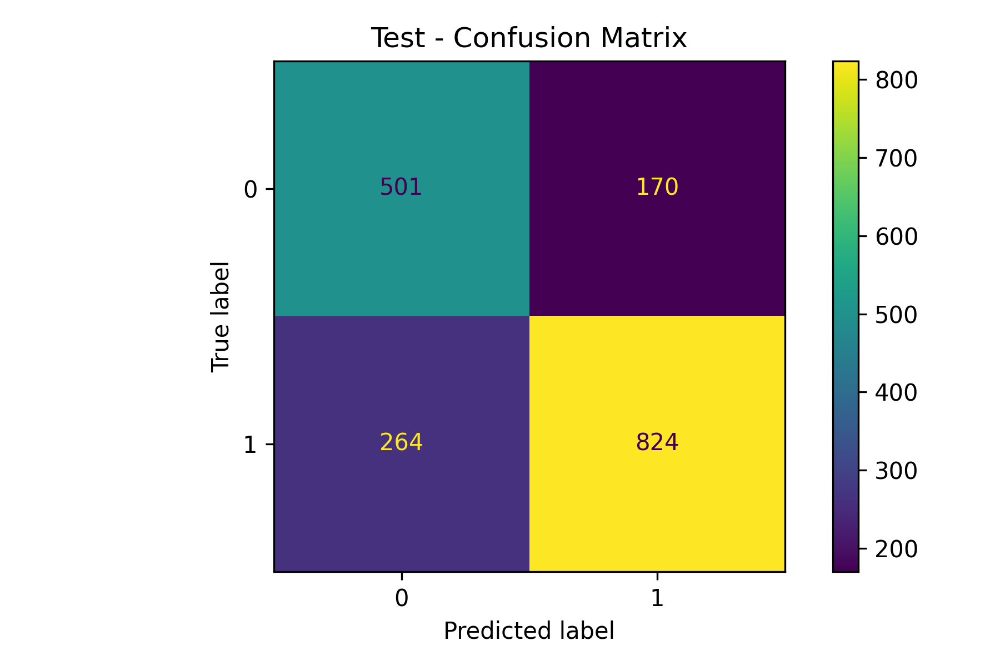
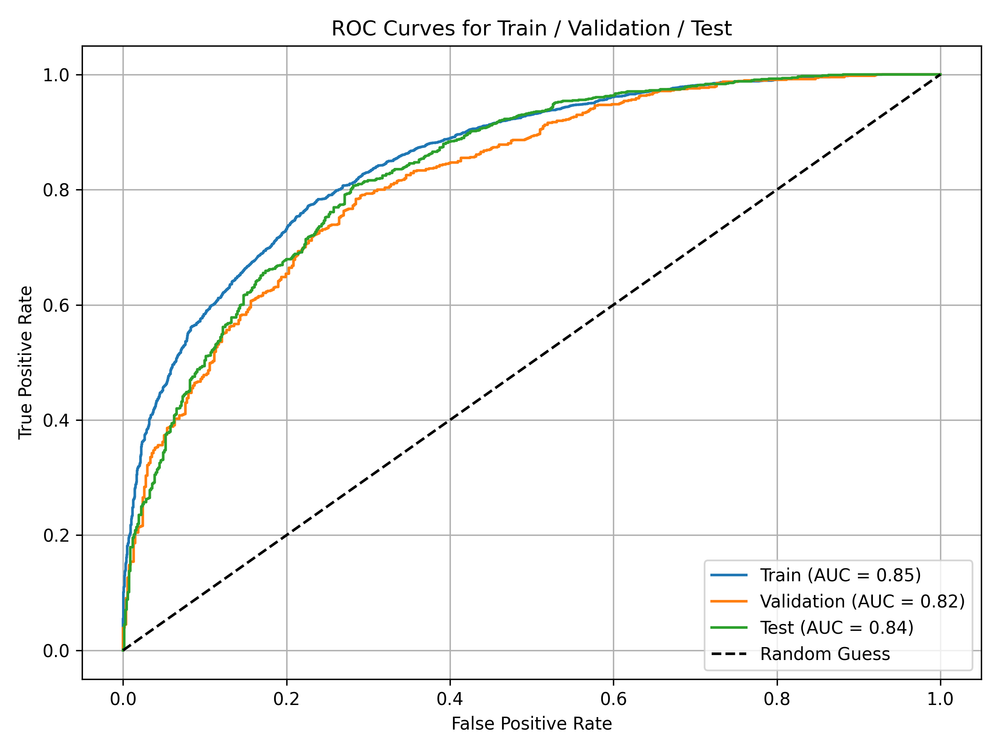

# MMA Fight Prediction AI

## Overview

MMA Fight Prediction AI is a machine learning project developed to predict the outcome of professional MMA fights using historical fighter statistics and performance metrics.

The system utilizes multiple XGBoost models trained on different feature representations and combines their predictions through an ensemble-based optimization process. Additional feature weighting techniques are applied to maximize predictive performance.

---

## Live Demo

Try the deployed web application:

🌐 https://octagon-ai.streamlit.app/

The platform allows users to compare two MMA fighters and generate fight outcome predictions using the ensemble machine learning system described in this repository.

## Dataset

The dataset consists of professional MMA fighter statistics collected from historical fight records.

### Features

#### Career Performance Metrics

* Total Fights
* Wins
* Finishes
* KO/TKO Wins
* Submission Wins
* Decision Wins
* Win Rate

#### Streak Statistics

* Current Win Streak
* Current Losing Streak
* Longest Win Streak
* Longest Losing Streak

#### Championship Performance

* Title Fight Wins

#### Striking Statistics

* Significant Strikes Landed
* Significant Strikes Attempted
* Significant Strikes Landed per Minute
* Significant Strikes Absorbed per Minute
* Significant Strike Defense
* Knockdown Average

#### Grappling Statistics

* Takedowns Landed
* Takedowns Attempted
* Takedown Average
* Takedown Defense
* Average Takedown Defense
* Submission Average

#### Strike Distribution

* Standing Strikes
* Clinch Strikes
* Ground Strikes
* Head Strikes
* Body Strikes
* Leg Strikes

#### Physical Attributes

* Reach
* Height
* Weight
* Date of Birth (Age)

#### Fighting Stance

* Orthodox
* Southpaw
* Switch
* Open Stance
* Sideways Stance

#### Additional Features

* Average Fight Time
* Absorption Efficiency Ratio
* Fighter Image Embedding

---

## Methodology

Three independent XGBoost models were developed using different feature engineering approaches.

### 1. Difference-Based Model

For every feature, Fighter A's statistics are subtracted from Fighter B's statistics.

Example:

```text
Reach Difference
Height Difference
Age Difference
Takedown Difference
Striking Difference
```

This representation focuses on relative advantages between fighters.

#### Results

| Metric    | Score  |
| --------- | ------ |
| Accuracy  | 74.36% |
| Precision | 81.88% |
| Recall    | 75.18% |
| F1 Score  | 78.39% |
| ROC-AUC   | 80.93% |

#### Visualization

#### Confusion Matrix


#### ROC Curve



---

### 2. Raw Statistics Model

Both fighters' complete statistics are provided directly to the model without subtraction.

Example:

```text
Fighter A Statistics
Fighter B Statistics
```

This allows the model to learn fighter-specific patterns and interactions.

#### Results

| Metric    | Score  |
| --------- | ------ |
| Accuracy  | 75.50% |
| Precision | 82.30% |
| Recall    | 76.93% |
| F1 Score  | 79.52% |
| ROC-AUC   | 83.19% |

#### Visualization

#### Confusion Matrix



#### ROC Curve



---

### 3. Combined Model

A third model was trained using a combination of both representations.

The system leverages:

* Difference-Based Features
* Raw Fighter Statistics
* Hybrid Feature Representation

#### Results

| Metric    | Score  |
| --------- | ------ |
| Accuracy  | 75.33% |
| Precision | 82.90% |
| Recall    | 75.74% |
| F1 Score  | 79.15% |
| ROC-AUC   | 83.50% |

#### Visualization

#### Confusion Matrix



#### ROC Curve



---

## Ensemble Optimization

After training the three XGBoost models, their outputs were combined through a custom weighted ensemble strategy.

The optimization process involved:

1. Generating predictions from three independent XGBoost models.
2. Combining model outputs through a weighted ensemble system.
3. Applying fighter-specific performance weighting factors.
4. Performing a brute-force search over thousands of weight combinations.
5. Evaluating each configuration on the validation set.
6. Selecting the weight configuration that achieved the highest predictive performance.

The final ensemble incorporates both model-level predictions and fighter-specific performance metrics.

A brute-force optimization process was used to evaluate thousands of weighting configurations and identify the highest-performing ensemble setup.

This optimization significantly improved the overall predictive performance of the system and produced the final ensemble model used for prediction.
## Ensemble Strategy

The final prediction system combines outputs from three independent XGBoost models using a custom fighter-aware weighting mechanism.

A dedicated ensemble module performs weighted fusion of model outputs and dynamically adjusts prediction scores according to fighter performance indicators.

Implementation:

`src/weighted_ensemble_predict.py`

### Final Optimized Performance

| Metric | Score |
|---------|---------|
| Accuracy | **76.46%** |
| Precision | **79.88%** |
| Recall | **82.81%** |
| F1 Score | **81.32%** |
| ROC-AUC | **82.30%** |

---

## Architecture

```text
                          Fighter Statistics
                                   │
                                   ▼
                       Feature Engineering Layer
                                   │
        ┌──────────────────────────┼──────────────────────────┐
        │                          │                          │
        ▼                          ▼                          ▼
 Difference Features      Raw Statistics Features    Hybrid Features
        │                          │                          │  
        │                          │                          │
        └──────────────┬───────────┬───────────┬──────────────┘
                       ▼           ▼           ▼
                    Model 1     Model 2     Model 3
                               
                                   │
                                   ▼
                         Ensemble Prediction Layer
                                   │
                                   ▼
                          Weight Optimization
                                   │
                                   ▼
                            Final Prediction
```

---

## Technologies

* Python
* XGBoost
* NumPy
* Pandas
* Scikit-Learn
* Matplotlib
* Seaborn

---

## Results Summary

| Model                    | Accuracy   | Precision | Recall | F1 Score | ROC-AUC |
| ------------------------ | ---------- | --------- | ------ | -------- | ------- |
| Difference-Based Model   | 74.36%     | 81.88%    | 75.18% | 78.39%   | 80.93%  |
| Raw Statistics Model     | 75.50%     | 82.30%    | 76.93% | 79.52%   | 83.19%  |
| Combined Model           | 75.33%     | 82.90%    | 75.74% | 79.15%   | 83.50%  |
| Final Optimized Ensemble | **76.46%** | **79.88** |**82.81**|**81.31**|**82.29**|

---

## Future Work

* Integration of deep learning architectures
* Fighter style classification
* Fight sequence analysis
* Explainable AI using SHAP values
* Real-time prediction platform
* Multi-model ensemble expansion

---

## Disclaimer

This project was developed for research and educational purposes. Predictions are generated solely from historical fighter statistics and do not constitute betting or financial advice.
